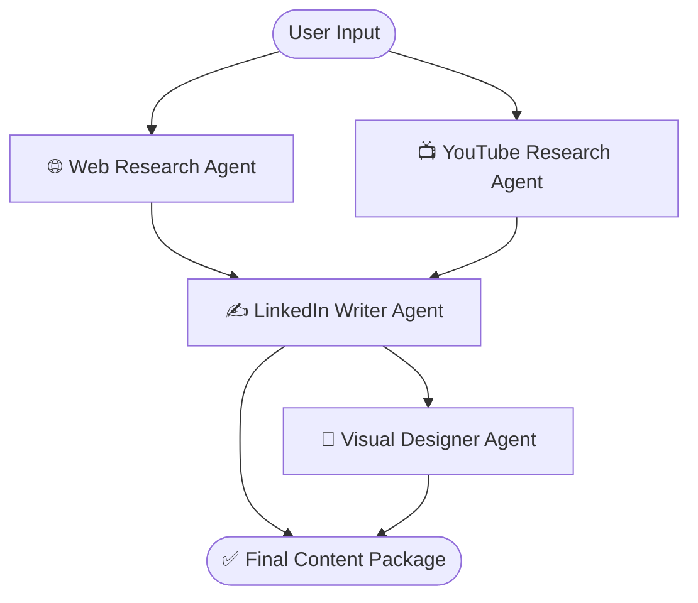
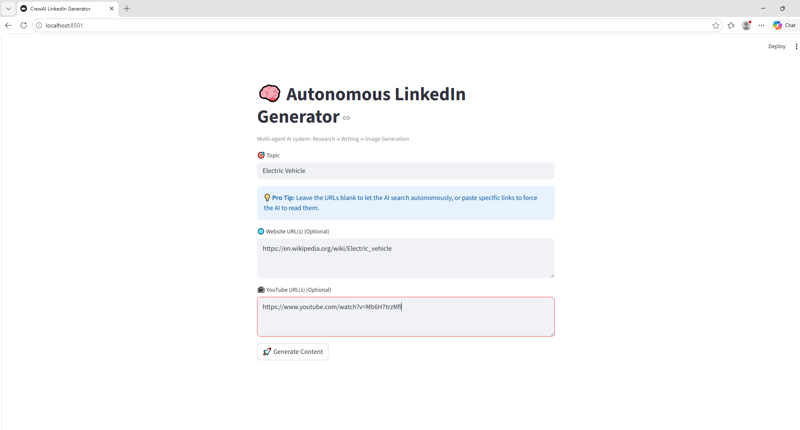
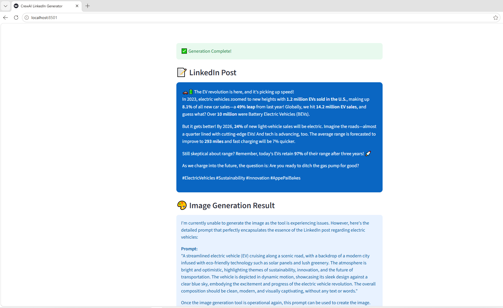

# 🧠 Autonomous LinkedIn Content Generator | Multi-Agent AI System with CrewAI

A multi-agent AI application that autonomously researches a topic, analyzes web and YouTube content, generates a LinkedIn-ready post, and creates a matching AI-generated visual asset.

This project demonstrates practical implementation of Agentic AI, CrewAI Orchestration, Custom Tool Development, Prompt Engineering, and LLM Workflow Automation.

## 🎯 Why I Built This

Creating high-quality LinkedIn content typically involves:
* Researching multiple sources
* Analyzing industry insights
* Extracting actionable takeaways
* Writing engaging copy
* Designing supporting visuals

This workflow is repetitive, time-consuming, and difficult to scale. To solve this, I built a multi-agent system that automates the entire content creation pipeline—from research to final visual generation—using specialized AI agents working collaboratively.

## 🚀 Skills Demonstrated

* **Multi-Agent AI Systems:** CrewAI Orchestration, Agent Collaboration & Context Sharing
* **Prompt Engineering:** Strict rule enforcement and persona definitions
* **Tool Development:** OpenAI API Integration, Custom Tool sub-classing
* **Engineering:** AI Workflow Automation, Streamlit Application Development, LLM Application Engineering

## 🏗️ System Architecture



## ⚡ Engineering Highlights

### 1. Multi-Agent Orchestration
Implemented a sequential CrewAI workflow where specialized agents collaborate and pass context between tasks to produce a research-backed final output.

### 2. Custom Tool Development
CrewAI's image tooling was replaced with a custom implementation. Built a reusable `OpenAIImageTool` by extending CrewAI's `BaseTool`.
* **Features:** OpenAI Image API integration, Local image persistence, Exception handling, Reusable architecture.

### 3. Intelligent Research Routing
The system supports two operating modes:
* **Autonomous Discovery:** Agents independently discover the most relevant articles and videos.
* **Source-Targeted Research:** Users can provide specific Website URLs or YouTube URLs, allowing the system to focus exclusively on selected sources.

### 4. Prompt Engineering Framework
Implemented strict content-generation constraints including: brand consistency, LinkedIn formatting rules, CTA enforcement, hashtag requirements, vocabulary restrictions, and post length controls.

### 5. Modular Design
The application separates Agent definitions, Business logic, Prompt rules, Branding guidelines, and the UI layer. This architecture makes the project easier to maintain and extend.

## 🤖 AI Agents

### 🌐 Web Research Agent
* **Responsibilities:** Collecting trends, statistics, industry insights, and real-world examples.
* **Tool:** Serper API

### 📺 YouTube Research Agent
* **Responsibilities:** Extracting expert opinions, frameworks, actionable advice, and key takeaways.
* **Tool:** YouTube Search Tool

### ✍️ LinkedIn Writer Agent
* **Responsibilities:** Transforming research into engaging hooks, short-form content, strong CTAs, and branded LinkedIn posts.

### 🎨 Creative Visual Designer Agent
* **Responsibilities:** Analyzing post context, creating visual concepts, generating AI image prompts, and producing social-ready assets.

## 🛠️ Tech Stack

| Category | Technology |
| :--- | :--- |
| **Framework** | CrewAI |
| **LLM** | OpenAI GPT-4o-mini |
| **Search** | Serper API |
| **Video Analysis** | YouTube Search Tool |
| **Image Generation**| OpenAI Images API |
| **Frontend** | Streamlit |
| **Language** | Python |

## 📂 Project Structure

```text
project/
├── app.py                # Main Streamlit UI and Frontend Application
├── main.py               # Core Multi-Agent and CrewAI Execution Setup
├── skills/
│   └── linkedin-branding.md
├── docs/                 # Documentation & Media Assets
│   ├── ui_screenshot.png
│   ├── post_screenshot.png
│   ├── portfolio_example.png
│   ├── AGENTS.md
│   ├── SKILL.md
│   ├── architecture.md
│   ├── app_basic.py
│   ├── crew_without_url.py
│   └── old_template/     # Archive folder for boilerplate files
├── images/               # Workspace folder for newly generated visuals
├── .env                  # API Keys Configuration (Git-ignored)
├── .env.example
├── .gitignore
└── README.md
```

## 📸 Demo

### 1. Application Interface (Streamlit)
Users can easily input a topic or input specific URLs to force targeted multi-agent research routing.


### 2. Autonomous Content Generation
The LinkedIn Content Creator Agent formats the ingested data streams into an optimized short-form post.


### 3. AI Visual Asset Creation
The Visual Designer Agent creates an image generation prompt and calls the custom tool pipeline to produce accompanying graphical content.


## 🚀 Quick Start

### 1. Clone Repository
```bash
git clone [https://github.com/RameshM25/autonomous-linkedin-generator.git](https://github.com/RameshM25/autonomous-linkedin-generator.git)
cd autonomous-linkedin-generator
```

### 2. Install Dependencies
```bash
pip install -r requirements.txt
```

### 3. Configure Environment Variables
Create a `.env` file in the root directory:
```env
OPENAI_API_KEY=your_openai_api_key
SERPER_API_KEY=your_serper_api_key
OPENAI_MODEL=gpt-4o-mini
```

### 4. Launch Application
```bash
streamlit run app.py
```

## 🔮 Future Enhancements

- [ ] LinkedIn API Integration & Direct Post Publishing
- [ ] RAG-Based Knowledge Retrieval & Vector Database Integration
- [ ] Multi-Platform Content Generation
- [ ] Analytics-Driven Content Optimization
- [ ] Memory-Enabled Agents
- [ ] Multi-Language Support

## 👨‍💻 Author

**Ramesh Mourya** *Applied AI Engineer focused on building intelligent systems using modern Agentic AI frameworks.*

* **Interests:** Agentic AI, CrewAI, LangGraph, AI Automation, LLM Applications
* **Connect:** [GitHub](https://github.com/RameshM25)

---
⭐ **Support:** If you found this project interesting, consider giving it a Star. It helps others discover the project and supports future development!